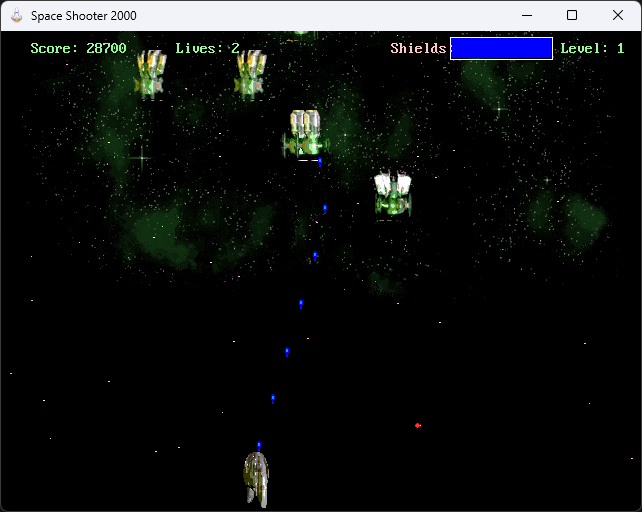

# Space Shooter 2000

This is a [QB64-PE](https://github.com/QB64-Phoenix-Edition/QB64pe) source port of the Space Shooter 2000 [Visual Basic 6](https://winworldpc.com/product/microsoft-visual-bas/60) game that came with Microsoft's [DirectX 7 SDK](https://github.com/oxiKKK/dx7sdk).

The original [Visual Basic 6](https://winworldpc.com/product/microsoft-visual-bas/60) sources can be found [here](https://github.com/oxiKKK/dx7sdk/tree/main/dx7sdk-700.1/samples/multimedia/vbsamples/dxmisc/src/spaceshooter) and [here](https://github.com/orbitersim/orbiter/tree/main/Extern/mssdk_dx7/samples/Multimedia/VBSamples/DXMisc/src/SpaceShooter).

This conversion has multiple changes and improvements over the Visual Basic 6 version. These are:

- Works natively on Windows, Linux & macOS
- No DirectX 7 dependencies
- Uses native [QB64-PE](https://github.com/QB64-Phoenix-Edition/QB64pe) graphics and sound functions
- Runs in 32bpp graphics mode unlike the original code that ran in 8bpp graphics mode
- Color key transparency is done on the BASIC side
- MIDI playback is handled using MIDI support in [QB64-PE](https://github.com/QB64-Phoenix-Edition/QB64pe)
- No sound buffer copy limit unlike the original code
- Alt + Enter puts the game in window mode

The source port still has some rough edges and bugs. You can see these under the "TODO" section in the source code. Joystick / game controller support is WIP. I will gradually work through these as and when I get time.

The source port also uses new features introduced in [QB64-PE v3.3.0+](https://github.com/QB64-Phoenix-Edition/QB64pe/releases) and as such may not work correctly or reliably with older versions of QB64-PE or any version of QB64. You've been warned. Please don't nag me about backwards compatiblity.

Icon by [Everaldo / Yellowicon](https://iconarchive.com/artist/everaldo.html)

There is a [YouTube Playthrough](https://www.youtube.com/watch?v=LnUwmS-mYPA) that helped me a lot while doing the source port. Shoutout to [David Coleman](https://www.youtube.com/user/TheFieryDreamer) for posting the video.

As usual, I do not accept responsibility for any effects, adverse or otherwise, that this code may have on you, your computer, your sanity, your dog, and anything else that you can think of. Use it at your own risk.

## Original Credits

Main programming, graphics, and MIDI music are by Adam "Gollum" Lonnberg.

Force Feedback implementation and conversion to DirectX 7 by Dominic "DirectX" Riccetti.

The following graphics are by Robert Barry:

- Enemy1.gif
- Enemy2.gif
- Enemy3.gif
- Enemy4.gif
- Ship.gif
- Blocker.gif

All sound effects created by Gordon Duclos.

Many thanks go out to the both of them.

## Trivia

I was supposed to complete the source port more than 10 years ago. Initially, I thought of just doing it using VB.Net. Lack of a good game programming library then (like [raylib](https://www.raylib.com/)) and procrastination got the better of me. So, the code basically lived on and moved from my HDDs, SSDs, systems, OneDrive and what not. I re-discovered QB64 in early 2022. QB64 had almost everything for me to complete the port. The place where it lagged behind was audio. I decided to work around these limitations by using my own custom libraries. Sadly, RC Cola happened and he burned everything QB64 was to the ground. A few good folks like [SteveMcNeill](https://github.com/SteveMcNeill), [mkilgore](https://github.com/mkilgore), [RhoSigma-QB64](https://github.com/RhoSigma-QB64) (just to name a few) picked up the pieces and built QB64-PE. I started opening issues on the QB64-PE GitHub and interacting with [mkilgore](https://github.com/mkilgore) while working on this port. One day, while discusssing MIDI support in QB64-PE [mkilgore](https://github.com/mkilgore) [motivated me](https://github.com/QB64-Phoenix-Edition/QB64pe/issues/115#issuecomment-1176112854) (probably unknowingly) enough to replace the QB64-PE [OpenAL Soft](https://github.com/kcat/openal-soft) LGPL audio backend with [miniaudio](https://miniaud.io/) and implement audio format support (like MIDI, MOD, S3M, XM, IT) which were present in old QB64-SDL versions. I managed to complete the [miniaudio](https://miniaud.io/) implemetation sometime in August 2022 and [mkilgore](https://github.com/mkilgore) was able to merge the changes to the QB64-PE repo. [SteveMcNeill](https://github.com/SteveMcNeill) generously offered me to become a QB64-PE dev which I gladly accepted. And here we are.
